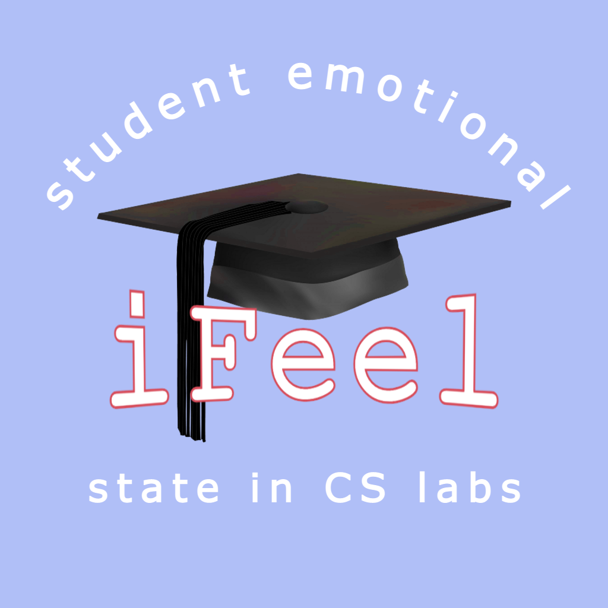

<!-- App Icon -->

    
    <h2>iFeel</h2>

    iFeel is an application developed for the purpose of studying students affective states during CS1 labs. 

    

## :page_facing_up: Documentation

<table>
<tbody>
    <tr>
        <td><b>Dependencies</b></td>
        <td>
        
        
        
        
        
        
         
        
        

</tbody>
</table>

## :compass: Project Layout

## :scroll: License