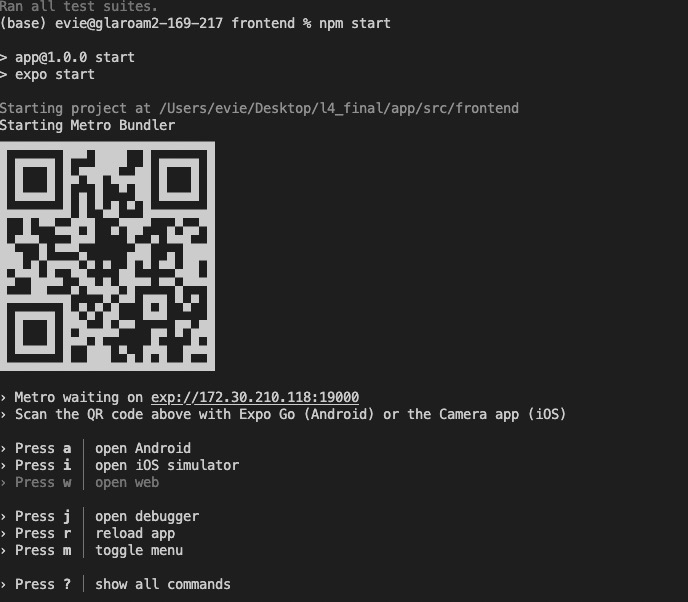
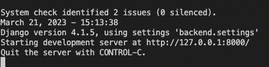

<div align="center">
<p align="center">
    
    <h2>iFeel</h2>
</p>
<p align="center">
    iFeel is an application developed for the purpose of studying students affective states during CS1 labs. 
</p>
</div>

## Set up
To start up iFeel, the user must navigate to folder [`src/frontend`](/src/frontend/) and run the following commands in terminal

‘npm i’
```sh
npm i       #installs frontend requirements
```
Followed by
```sh
npm start      #begins the application in development
```
-	This will run the application on a development server. This can then be run on an ios mobile device simulator or an ios mobile device. 

## Running on IOS device

The app can be accessed by scanning the QR code shown with an ios device camera after running the npm start. 

This is the expo development prompt that will be displayed.

## Running simulated app from personal computer

The app can be run by typing
```sh
i      #begins the application in development
```
into the terminal which will open an ios device simulator and the app can be used as expected from there.

## Backend database
The backend database is hosted with railway (https://docs.railway.app/ ) online to allow users to use the application on their mobiles. 

The backend can also be accessed by navigating to the [`src/backend`](/src/backend/) directory in the repository. From here the following commands can be run in a terminal:
- To set up the backend development run 
    ```sh
    python -m pip install --upgrade pip 
    pip install -r requirements.txt     #installs backend requirements
    ```
 - To work on the development database locally, run 
    ```sh
    pipenv shell    #opens virtual environment
    python manage.py runserver #runs database over localhost
    ```

The terminal will then show a message like the following


Navigate to the url with 'Starting development server at http://127.0.01:8000/ ' with admin appended to the end (Note the url may be different). This would be:
http://127.0.01:8000/admin 

It is possible to log in to the admin site from the user’s local host hosted here with same tutor credentials:
username : 1234567t and password : testpassword

This is can be used in the case the user wishes to make fundamental model changes to the database.

## Using the population script
While the data in the population script is not meaningful and as such is unlikely to provide valuable insights into the use of the application, it can be used to see how mass data may appear in the application.

To run this script:

-	Navigate to [`src/backend`](/src/backend/)
-	Delete ‘db.sqlite3’

Then in the terminal, run the following commands
```sh
    python -m pip install --upgrade pip    #installs pip
    pip install -r requirements.txt
    pipenv shell
    python manage.py makemigrations     #sets up database models
    python populate_app.py      #populates database
```

To access all the users and the data populated, run 
 ```sh
    python manage.py runserver #runs database over localhost
```
The terminal will then show a message like the following


Navigate to the url with 'Starting development server at http://127.0.01:8000/ ' with admin appended to the end (Note the url may be different). This would be:
http://127.0.01:8000/admin 

It is possible to log in to the admin site from the user’s local host hosted here with same tutor credentials:
username : 1234567t and password : testpassword

